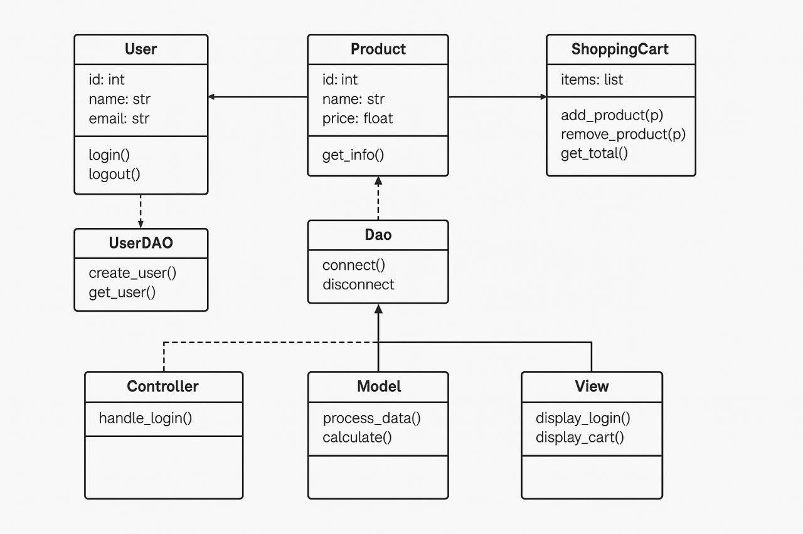
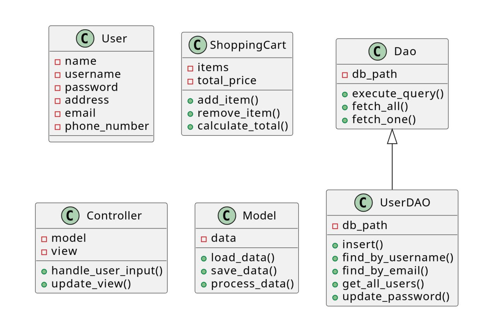
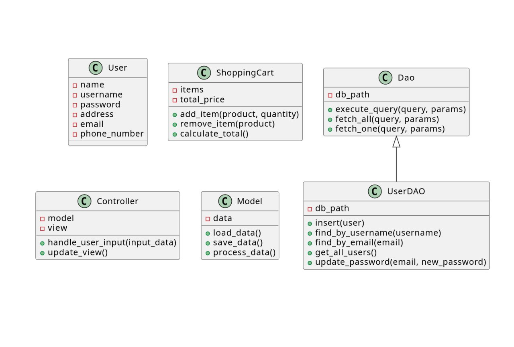
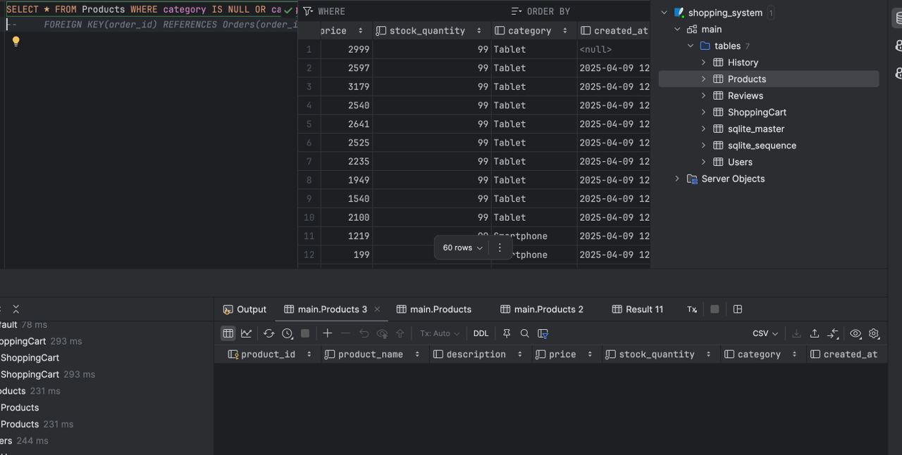
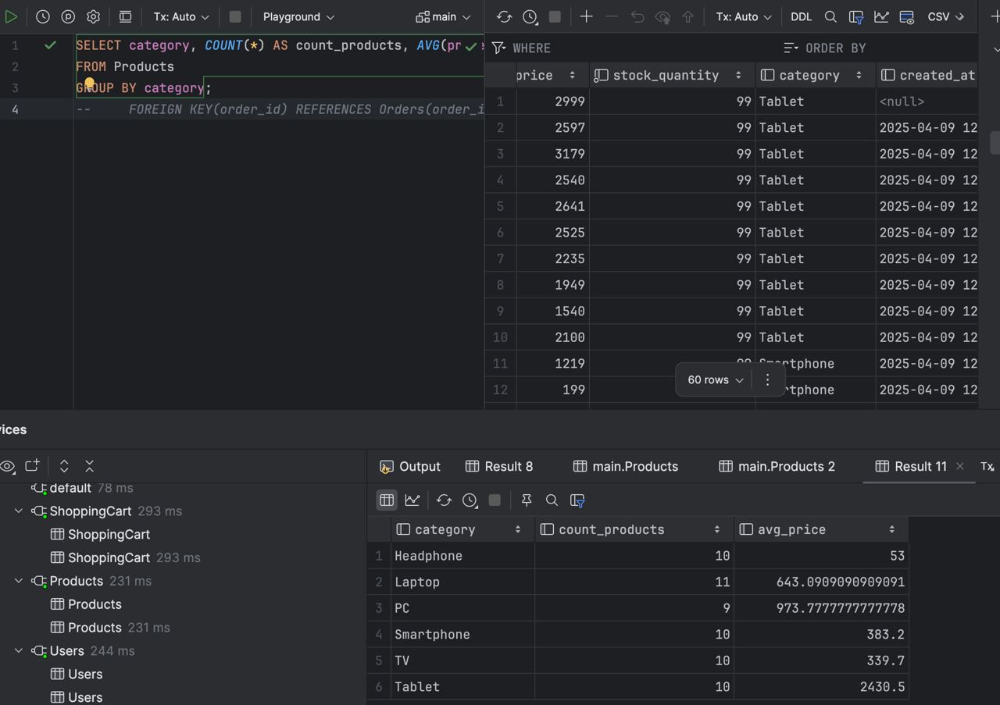
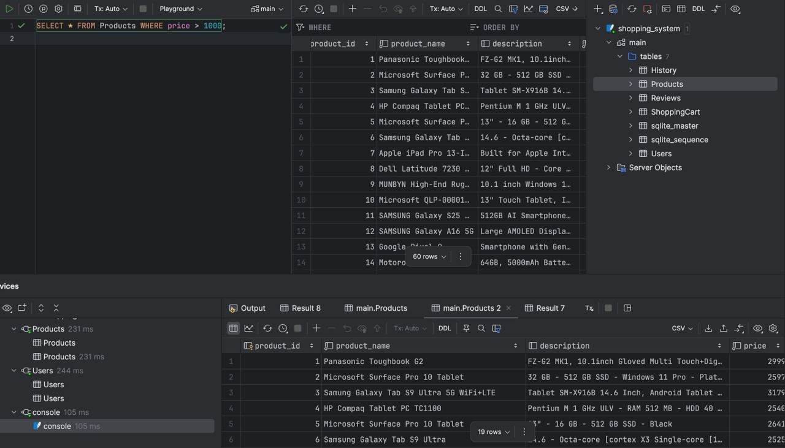
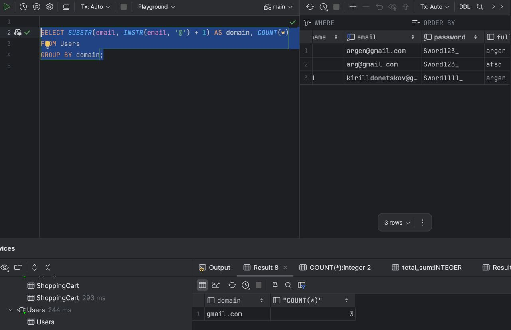
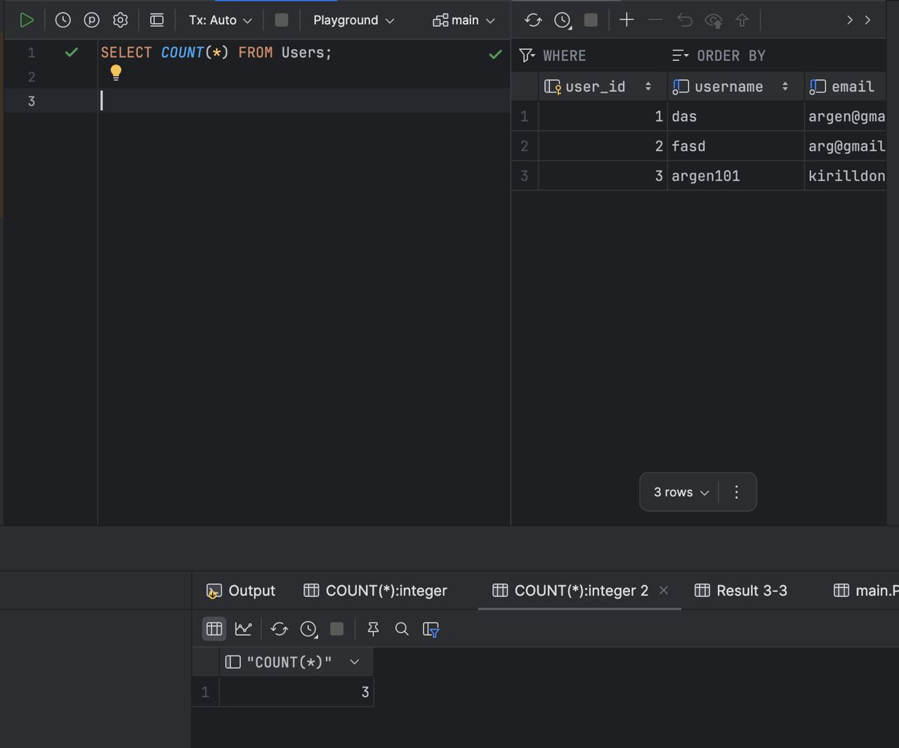

# 🛍️ Simple GUI Shopping System

This repository contains the simple shopping system built on Python. This project has Graphical User Interface(GUI) and implementation of databases.

## 👥 Our Team
- [Argen Kulzhanov](https://github.com/argenkuz) (argenkuz): 🎨 Design and GUI.
- [Kirill Donetskov](https://github.com/kd0nwww) (kd0nwww): 🧠 Code and logic.
- [Magomed Mukhamedov](https://github.com/Quadraft) (Quadraft): 🗄️ Databases and documentation.

## 📂 Structure

- [user.py](/project/classes/user.py) : Contains the class that creates `User` instances.
- [product.py](/project/classes/product.py) : Contains the class that creates `Product` instances.
- [shoppingcart.py](/project/classes/shoppingcart.py) : Class that creates `ShoppingCart` instances.
- [base_dao.py](/project/dao/base_dao.py) : Contains the base DAO class (`Dao`) that is responsible to make CRUD operations with the database.
- [user_dao.py](/project/dao/user_dao.py) : Contains DAO class that inherits from `Dao` that is in base_dao.py.
- [products_dao.py](/project/dao/products_dao.py) : Contains DAO class that inherits from `Dao` that is in base_dao.py.
- [shoppingcart_dao.py](/project/dao/shoppingcart_dao.py) : Contains DAO class that inherits from `Dao` that is in base_dao.py.
- [parser](/project/parser) : Simple Amazon web scraper.
- [controller.py](/project/controller.py) : This file makes the connection between logic and design.
- [login.py](/project/login.py) : File with the design of login page.
- [main.py](/project/main.py) : File that launches the whole program.
- [model.py](/project/model.py) : File that contains the logic of program.
- [qt.py](/project/qt.py) : File that contains the design of starting page.


## 🧑‍💻 User class
The User class represents a shopping system user. Attributes are listed below. The class also includes getters and setters for each attribute. Magic method `__str()__` is used here for formatted string representation.

### Attributes 
- `name`: User's name.
- `username`: User's username.
- `password`: User's password.
- `address`: User's address.
- `email`: User's email.
- `phone_number`: User's phone number.

## 🛒 Product class
The Products class represents a product in the shopping system. It has getters and setters for each attribute.

### Attributes
- `product_name`: Name of product.
- `description`: Dedcription of product.
- `price`: Product's price.
- `stock_quantity`: Amount of products available.
- `category`: The category of produc.

### Methods
- `is_available(amount: int)`: Returns `True` if `amount` of products are available.
- `update_stock(quantity: int)`: Changes the number of available items.

## 🗄️ Dao class
This class represents a blueprint for managing user-related database operation classes.

### Attributes
- `db_path`:  path do database.

### Methods
- `execute_query(query: str, params=None)`: Executes the SQL query that is given in `query` attribute with some parameters which are `None` by default.
- `fetch_all(query: str, params=None)`: Return all records contained in cursor.
- `fetch_one(query: str, params=None)`: Return one record contained in cursor.

## 👤 UserDAO class
This class provides functionality to interact with the Users table in the database. 
The class includes methods to insert new users, retrieve user details by username or email, fetch all users, and update user passwords. Inherits from `base_dao.py`.

### Attributes
- `db_path`: path do database.

### Methods
- `insert(user: User)`: Inserts new `User` object into Users table.
- `find_by_username(username: str)`: Finds the record in database with the given `username`.
- `find_by_email(email: str)`: Finds the record in database with the given `email`.
- `get_all_users()`: Return all `User` objects contained in database.
- `update_password(email: str, new_password: str)`: Updates the `User` objects password with the given `email`.

## 📦 ProductsDAO class
This class provides functionality to interact with the Products table in the database. 
The class includes methods to insert new products, retrieve product details by product name, fetch all products, update product stock and delete products from table. Inherits from `base_dao.py`.

### Attributes
- `db_path`: path do database.

### Methods
- `insert(product: Products)`: Adds new product into table.
- `find_by_product_name(product_name: str)`: Finds product by its name.
- `get_all_products()`: Returns all records from Products table.
- `update_stock(product_name: str, quantity: int)`: Updates stock of the product.
- `delete(product_name: str)`: Deletes product by product name.

## 🛒 ShoppingCartDAO class
This class provides functionality to interact with the Shoppingcart table in the database. The class includes methods to add, update, delete and retrieve items from the cart. Inherits from `base_dao.py`.

### Attributes
- `db_path`: path do database.

### Methods
- `insert(product_name: str, price: int, quantity: int)`: Adds new item into the cart.
- `find_by_product_name(product_name: str)`: Finds item by its name.
- `update_quantity(product_name: str, quantity: int)`: Updates the amount of specific item in the cart.
- `delete_all()`: Deletes all items from the cart.
- `get_all_items()`: Retrieves all items from the cart.
- `get_headers()`: Returns all column names in the table.
- `get_all_items_without_id()`: Returns all columns expect the id column.

## 🧠 Model class
This class contains the logic of whole program. Contains methods related to account creation, passwords creation and validation of emails. The one from the most important functions is `send_reset_password` which sends and then validates 4-digit code for password reset.

### Methods
- `create_account(name: str, username: str, password: str, address: str, email: str, phone_number: str)`: Allows user to create account, displays errors if something goes wrong.
- `is_strong_password(password: str)`: Checks if password contains at least one capital letter, digit and special symbol.
- `validate_email(email: str)`: Checks if email is valid.
- `is_valid_phone_number(phone_number: str)`: Checks if phone number is valid.
- `len_of_username(self,username)`: Returns the length of username.
- `send_reset_password(self,email)`: Sends reset 4-digit code to email address of the user. Allows to change password if the code is valid.

## 🔗 Controller class
### Methods
- `show_main_window()`: Displays the main application window and initializes its buttons.
- `show_login_window()`: Displays the login window and initializes its buttons.
- `show_cart_window()`: Displays the shopping cart window and loads the cart table.
- `init_main_window_buttons()`: Connects buttons in the main window to their respective actions.
- `init_login_window_buttons()`: Connects buttons in the login window to their respective actions.
- `get_plain_text(html_text: str)`: Converts HTML text to plain text.
- `add_to_cart(new_label: PyQt6.QLabel, price_label: PyQt6.QLabel)`: Adds an item to the shopping cart or updates its quantity if it already exists.
- `set_visible()`: Hides specific labels in the login window.
- `switch_to_tab_login()`: Switches to the login tab in the login window.
- `switch_to_tab_create_account()`: Switches to the create account tab in the login window.
- `on_cancel_create_account_clicked()`: Cancels the account creation process and switches to the login tab.
- `switch_to_tab_condition_of_use()`: Switches to the "Condition of Use" tab in the login window.
- `switch_to_tab_usage_policy()`: Switches to the "Usage Policy" tab in the login window.
- `login_account()`: Authenticates the user and displays login success or error messages.
- `on_forgot_password_clicked()`: Switches to the "Forgot Password" tab in the login window.
- `on_cancel_clicked()`: Closes the login window.
- `create_account()`: Creates a new user account and validates the input fields.
- `on_send_code_clicked()`: Sends a password reset code to the user's email.
- `on_check_code_clicked()`: Verifies the password reset code and switches to the password reset tab.
- `change_password()`: Changes the user's password after validation.
- `load_image_from_url(label: PyQt6.QLabel, url: str)`: Loads an image from a URL and displays it in a label.
- `highlight_labels()`: Clears the search query and resets label highlights.
- `load_cart_table()`: Loads the shopping cart data into the cart table widget.

### 🖼️ UML Diagrams

---

---


## 📊 Database Reports
### Checking if the product does not have a category.

---
### Displaying each category, number of products in each category and average price in each category.

---
### Displaying products with the price more than 1000.

---
### Counting domains of email addresses.

---
### Counting number of users.


## ⚙️ Installation and Usage
1. Clone the repository:
    ```bash
    git clone https://github.com/argenkuz/Shopping-system.git
    ```
2. Navigate to the project directory:
    ```bash
    cd project
    ```
3. Download all dependencies:
    ```bash
    pip install -r requirements.txt
    ```
4. Run the script:
    ```bash
    python main.py
    ```